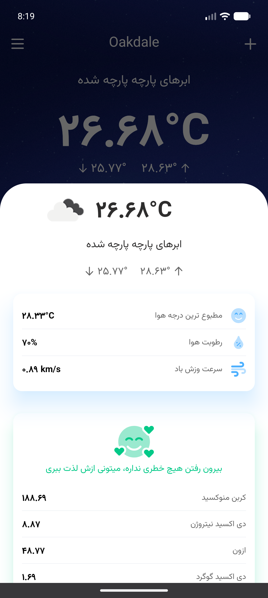

# Weather App With Kotlin
Weather App using the API from https://openweathermap.org

The technologies used in this project consist of:

* RoomDatabase
* ViewBinding
* DiffUtils
* Flow
* Hilt
* MVVM
* LiveData
* Coroutines
* Retrofit
* xml

## Screenshots

    

   
